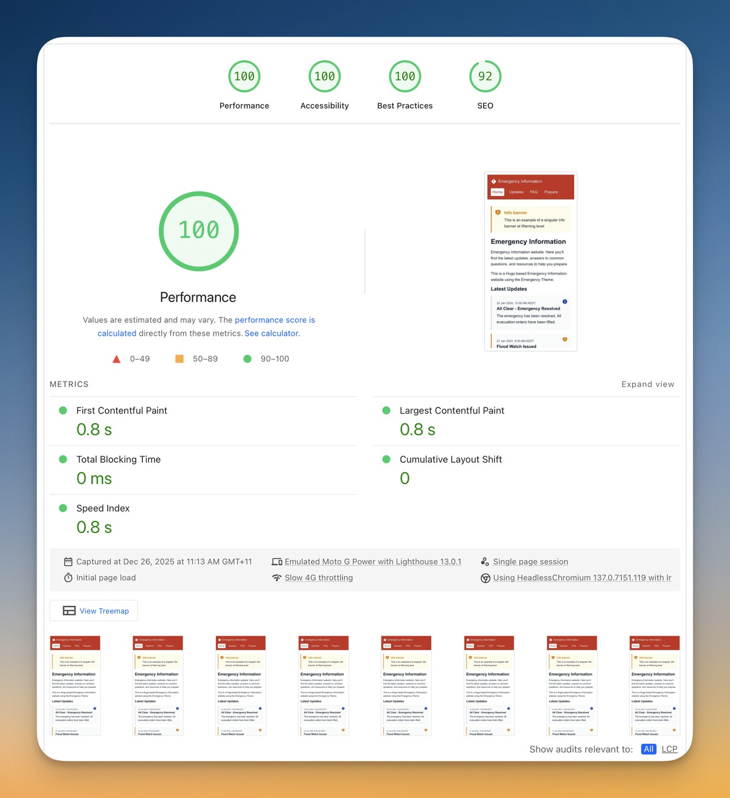

# Emergency Site Kit

A lightweight, performant, and accessible Hugo theme for emergency information websites. Designed to work under extreme conditions with poor connectivity.

When disaster strikes, traditional CMS websites often buckle under traffic surges while damaged infrastructure leaves affected communities with unreliable connections. This theme enables rapid deployment of resilient emergency sites — built using simple technologies for maximum reliability.


## Features

- ⚡ **< 14KB first load** — Fits in single TCP roundtrip
- 🔌 **Offline support** — Service worker caches pages
- ♿ **WCAG AAA accessible** — 7:1+ contrast, keyboard navigation
- 📱 **Mobile-first** — Works on any device
- 🚀 **One-click deploy** — Cloudflare Pages ready

## Quick Start

### Deploy to Cloudflare Pages


1. Fork this repository
2. Go to [Cloudflare Pages](https://pages.cloudflare.com/)
3. Click **Create application** → **Pages** → **Connect to Git**
4. Select your fork and configure:
   - **Framework preset**: `Hugo`
   - **Build command**: `cd src && hugo --minify`
   - **Output directory**: `src/public`
   - **Environment variable**: `HUGO_VERSION` = `0.147.7`

### Local Development

```bash
cd src
hugo server
```

Site available at `http://localhost:1313`

### Build for Production

```bash
cd src
hugo --minify
```

Output in `src/public/`

---

## Project Structure

```
hugo-emergency-site/
├── src/                      # Hugo source code
│   ├── archetypes/           # Content templates
│   ├── content/              # Markdown content
│   │   ├── updates/          # Emergency updates
│   │   ├── faq/              # FAQ entries
│   │   └── prepkit/          # Preparation kits
│   ├── themes/emergency/     # Theme (portable)
│   │   ├── assets/css/       # Critical CSS
│   │   ├── layouts/          # HTML templates
│   │   └── static/           # Icons, service worker
│   └── hugo.toml             # Site configuration
├── docs/                     # Project documentation
├── cloudflare.toml           # Deployment config
└── README.md
```

---

## Configuration

Edit `src/hugo.toml`:

```toml
title = "Emergency Information"
theme = "emergency"

[params]
  description = "Emergency information and updates"
  themeColor = "#B91C1C"
  
  # Contact info (shown in footer)
  email = "contact@example.org"
  telephone = "+61 2 1234 5678"
  orgName = "Emergency Response Team"
  
  # Local timezone for timestamps
  timezone = "AEDT"
  
  # Alert banner (leave alertMessage empty to hide)
  alertTitle = "Current Emergency"
  alertMessage = "Important information here"
  alertLevel = "warning"  # info, warning, critical
```

---

## Content Types

### Updates

Emergency announcements with timestamps and severity levels.

```bash
cd src && hugo new updates/2024-01-20-situation-update.md
```

```markdown
---
title: "Situation Update"
date: 2024-01-20T14:00:00+11:00
severity: "warning"
summary: "Brief summary for listing pages"
---

Content here...
```

#### Severity Levels

| Level | Use Case | Styling |
|-------|----------|---------|
| `info` | Resolved situations, general updates | Blue pill, grey border |
| `warning` | Developing situations, caution needed | Amber pill, amber border |
| `critical` | Immediate danger, urgent action | Red pill, red border |

### FAQ

```bash
cd src && hugo new faq/question-title.md
```

### Preparation Kits

```bash
cd src && hugo new prepkit/kit-name.md
```

---

## Using the Theme Separately

The theme can be used in any Hugo site:

```bash
# As Git submodule
git submodule add https://github.com/halans/hugo-emergency-site-kit themes/emergency

# Or copy directly
cp -r src/themes/emergency your-site/themes/
```

Then in your `hugo.toml`:
```toml
theme = "emergency"
```

---

## Customization

### Override Templates

Create the same path in your site's `layouts/` to override theme templates.

### Override Styles

Create `assets/css/critical.css` in your site root to replace theme styles.

---

## Accessibility

- ✓ Skip to content link
- ✓ Semantic HTML with ARIA landmarks
- ✓ 7:1+ color contrast (WCAG AAA)
- ✓ Keyboard navigation
- ✓ Screen reader optimized
- ✓ Reduced motion support
- ✓ Print stylesheet

---

## Performance

| Metric | Value |
|--------|-------|
| First load (gzipped) | **~3 KB** |
| Total site size | **< 250 KB** |
| JavaScript required | **0 KB** |
| Build time | **< 20ms** |

### Pagespeed Insights



---

## Documentation

- [Implementation Plan](docs/IMPLEMENTATION_PLAN.md)
- [Design Decisions](docs/DESIGN_DECISIONS.md)
- [Tasks](docs/TASKS.md)

---

## License

MIT

Created with Antigravity and Claude Opus 4.5, using [Hugo](https://gohugo.io) v0.147.7+extended+withdeploy